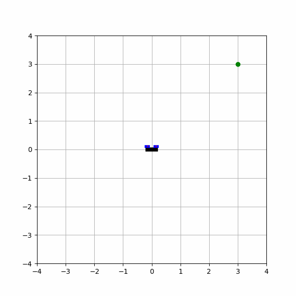
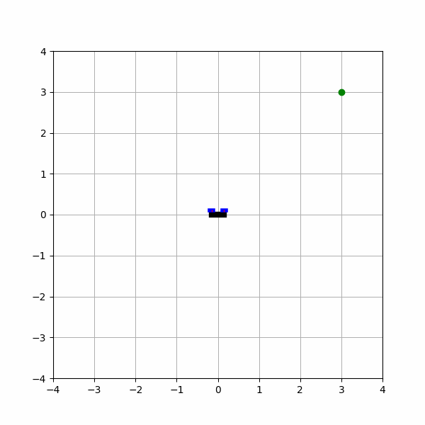
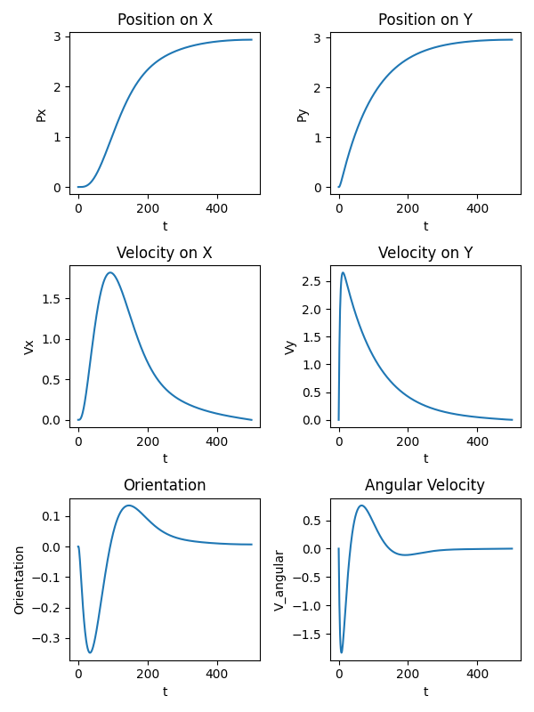
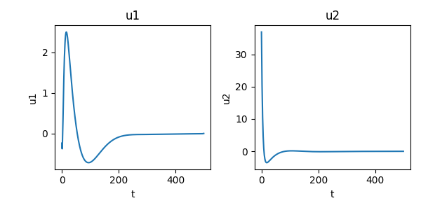

## Drone Control
This repo designs optimal control strategy to move a 2D drone from its initial position to the desired position while minimizing the cost, which is composed distance to the goal, velocities, and control effort over time. Part of ROB-GY 6323.

We consider the following simplified linear model of the drone
```math
\begin{align*}
    x_{n+1} = A
    x_n + B u_n
\end{align*}
```
where the components of the state $x_n$ correspond to the horizontal position and velocity of the quadrotor, its vertical position and velocity and its orientation and angular velocity. The control vector
$u_n$ contains the forces produced by the rotors (our control inputs).
The module ```quadrotor.py``` defines the matrices $A$ and $B$ and code to generate a simulation of the drone.

In this case, I want to generate a control input will move the drone towards the point $(3,3)$ starting from $(0,0)$. In order to
do so, I define a cost that penalizes the distance to the goal at each time step while minimizing velocities and the amount of trust needed,
i.e. we want to solve the following optimal control problem
```math
\begin{align*}
&\min_{x_0, u_0, x_1, u_1, \cdots} \frac{1}{2}\sum_{n=0}^{N} (x_n - x_{desired})^T Q (x_n - x_{desired}) + u_n^T R u_n\\
\textrm{subject to}\ \ & x_{n+1} = A x_{n} + B u_n\\
& x_0 = [0,0,0,0,0,0]^T
\end{align*}
```
where $x_{desired} = [3,0,3,0,0,0]^T$


I write my KKT conditions as the following:

The Lagrangian is 

$L(y,\lambda) = \frac{1}{2} y^T G y + g^T y + \lambda^T (M y - p)$
 
and the KKT conditions for optimality are
```math
\begin{bmatrix} G & M^T \\ M & 0 \end{bmatrix} \begin{pmatrix} y \\ \lambda \end{pmatrix} = \begin{pmatrix} -g \\ p \end{pmatrix}
```
where  
```math
g^T = \begin{pmatrix} -\bar{x}_{desired}^T Q & 0 &  -\bar{x}_{desired}^T Q & 0 & -\bar{x}_{desired}^T Q & \cdots \end{pmatrix},
```
```math
p^T = \begin{pmatrix}x_{init} & 0 & 0 &\cdots \end{pmatrix},
```
```math
G = \begin{bmatrix}
Q & 0 & 0 & 0 & ...\\
0 & R & 0 & 0 & ...\\
0 & 0 & Q & 0 & ...\\
0 & 0 & 0 & R & ...\\
0 & 0 & 0 & 0 & \ddots
\end{bmatrix}, M = \begin{bmatrix}
I & 0 & 0 & 0 & 0 & 0 & ...\\
A & B & -I & 0 & 0 & 0 & ...\\
0 & 0 & A & B & -I & 0 &  ...\\
0 & 0 & 0 & 0 & A & B & ...\\
0 & 0 & 0 & 0 & 0 & 0 & \ddots
\end{bmatrix}
```

## Result

<p align="center">
  <figure style="display:inline-block; margin:10px">
    
    <figcaption>Initial</figcaption>
  </figure>
  <figure style="display:inline-block; margin:10px">
    
    <figcaption>Final</figcaption>
  </figure>
</p>

## Plots of states and optimal control over time



